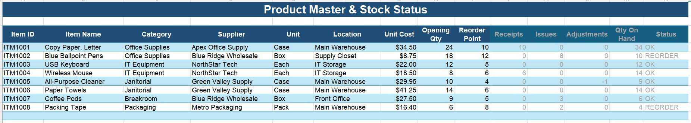
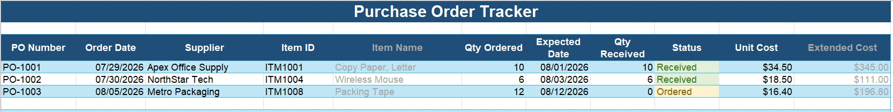
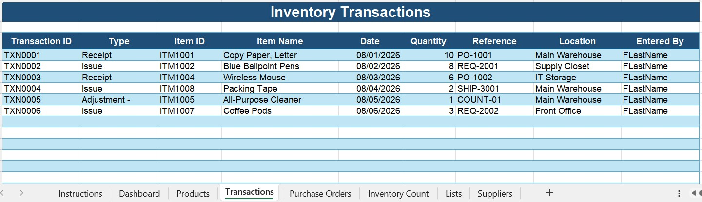
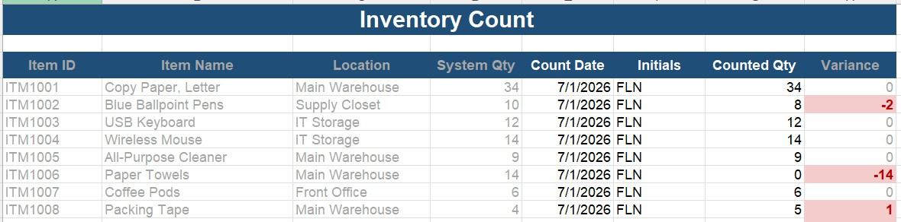
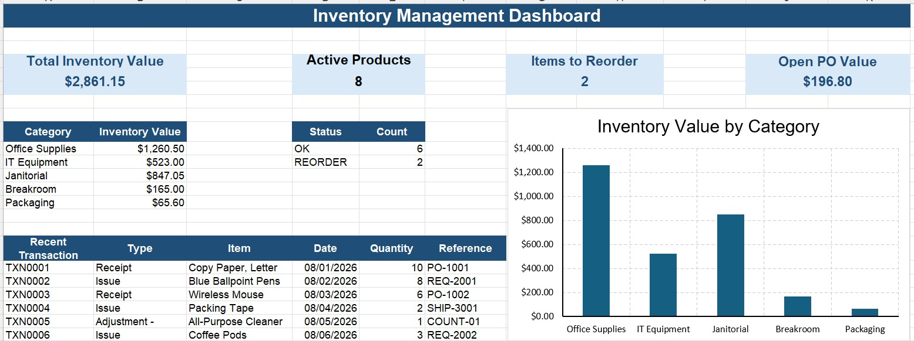

# Inventory Management Workbook

An Excel-based inventory management solution that helps small businesses track inventory levels, purchase orders, stock movements, and reorder needs. The workbook automates calculations, highlights low-stock items, and provides real-time inventory visibility.

---

## Overview

Managing inventory with multiple spreadsheets can lead to inaccurate stock counts, missed purchase orders, and unnecessary manual work. This workbook demonstrates how Microsoft Excel can be used to create an organized inventory tracking system that improves accuracy and streamlines inventory management.

Designed for small businesses, retail operations, warehouses, and office supply management.

---

## Features

- Track inventory quantities by item
- Automatically calculate available inventory
- Record inventory receipts and issues
- Monitor purchase order status
- Display current on-hand quantities
- Highlight low-stock items requiring reorder
- Maintain minimum and reorder stock levels
- Track supplier information
- Generate inventory summaries
- Reduce data entry errors using data validation
- Provide visual inventory alerts with conditional formatting
  
---

## Workbook Structure

### Project Inventory

Maintains the master inventory list.

| Column | Description |
|---------|-------------|
| Item ID | Unique inventory identifier |
| Description | Item description |
| Category | Product category |
| Supplier | Vendor name |
| Unit Cost | Cost per unit |
| Current Quantity | Current stock level |
| Reorder Point | Minimum desired quantity |
| Reorder Quantity | Suggested reorder amount |
| Status | In Stock, Low Stock, Out of Stock |



### Purchase Orders

Tracks inventory ordered from suppliers.

| Field | Description |
|-------|-------------|
| PO Number | Purchase Order ID |
| Vendor | Supplier |
| Order Date | Date ordered |
| Expected Delivery | Expected arrival |
| Quantity Ordered | Ordered amount |
| Quantity Received | Received amount |
| Remaining Balance | Outstanding quantity |
| Status | Open, Partial, Complete |



### Inventory Transactions

Records all inventory movement including:

- Inventory receipts
- Inventory usage or sales
- Quantity adjustments
- Returns

Inventory balances update automatically based on transaction history.



### Inventory Counts

Inventory counts in system to be compared to physical inventory counts.




### Dashboard

Provides an at-a-glance summary of:

- Total Inventory Items
- Total Inventory Value
- Low Stock Item Count
- Open Purchase Orders
- Recently Received Inventory



---

## Business Value

This workbook demonstrates how Excel can improve inventory management by:

- Reducing manual calculations
- Improving inventory accuracy
- Providing visibility into stock levels
- Identifying reorder needs
- Supporting purchasing decisions
- Saving time through automation

---

## Skills Demonstrated

- Microsoft Excel
- Advanced Formulas
- XLOOKUP
- SUMIFS
- COUNTIFS
- IF Statements
- Data Validation
- Conditional Formatting
- Structured Tables
- Inventory Control
- Process Automation
- Business Process Improvement

---

## Repository Contents

```
Inventory-Management/
│
├── Inventory_Management.xlsx
├── README.md
│
├── images/
│   ├── dashboard.jpg
│   ├── invoices.jpg
│   ├── purchase-orders.jpg
│   └── payments.jpg
```
---

## Future Enhancements

- Power Query data import
- VBA automation
- PivotTable reporting
- Power BI dashboard integration
- Barcode scanning support
- Automated reorder reports

---

```
